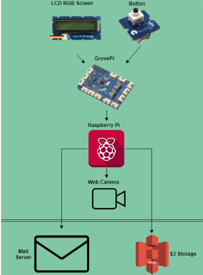

# software Project

Final project for my 4th year software project.

For this I developed a smart security camera using facial recognition from openCV and developed in python.

The system uses the following components found in the architecture diagram.

*S3 Script not included*

## Adding new user

To add a new user the user must press a button on the grove pi and when the script has loaded the RGB LCD screen will advise thekm to press it again

it will then search the Raspberrypi directory and add a new directory in order(If there is a directory called 1 it will then create a directory called number 2. etc..)

When a face is located(Purple rectangle) it will then add that image as a grayscale to the directory just created it will countdown the number of photos taken on the RGB LCD screen. The system will stop at 100 photos and begin the training model. 

*See Gif below for run through*

## Facial Recognition model

The faces.py page is the facial recognition model, From here it will recognise the face of the user who has been added and when a person who is not on the screen is shown(Barack obama) it will produce a message on the RGB LCD Screen and take a picture of the intruder, save it to the takenpictures directory under the name of a timestamp, it will then  access the most recently saved image in that folder and access it and send it to the owners email.

*See Gif below for run through*

